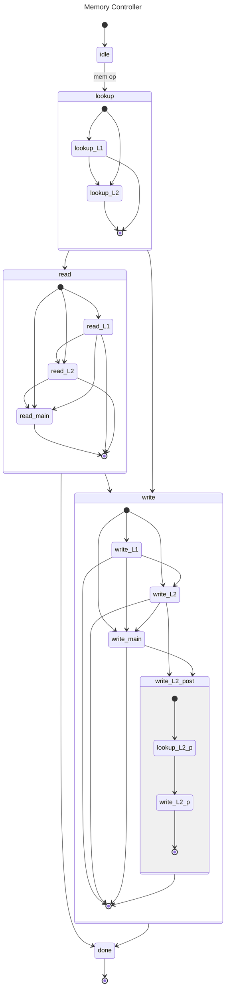

```mermaid
---
title: Memory Controller
---
stateDiagram-v2
    direction tb
    [*] --> idle
    idle --> lookup : mem op
    lookup --> read
    read --> write
    lookup --> write
    read --> done
    write --> done
    done --> [*]
  
    state lookup{
        direction tb
        %% main flow
        [*] --> lookup_L1
        lookup_L1 --> lookup_L2
        lookup_L2 --> [*]
        %% shortcuts
        [*] --> lookup_L2    
        lookup_L1 --> [*]
    }
  
    state read{
        direction tb
        [*] --> read_L1
        read_L1 --> read_L2
        read_L2 --> read_main
        read_main --> [*]
        %% shortcuts
        [*] --> read_L2
        [*] --> read_main
        read_L1 --> read_main
        read_L1 --> [*]
        read_L2 --> [*]
    }
  
    state write{
        direction tb
        [*] --> write_L1
        [*] --> write_L2
        [*] --> write_main
  
        write_L1 --> write_L2
        write_L1 --> write_main
        write_L1 --> [*]
  
        write_L2 --> write_main
        write_L2 --> write_L2_post
        write_L2 --> [*]
  
        write_main --> write_L2_post
        write_main --> [*]
  
        write_L2_post --> [*]
  
        state write_L2_post{
            direction tb
            [*] --> lookup_L2_p
            lookup_L2_p --> write_L2_p
            write_L2_p --> [*]
        }
    }
```